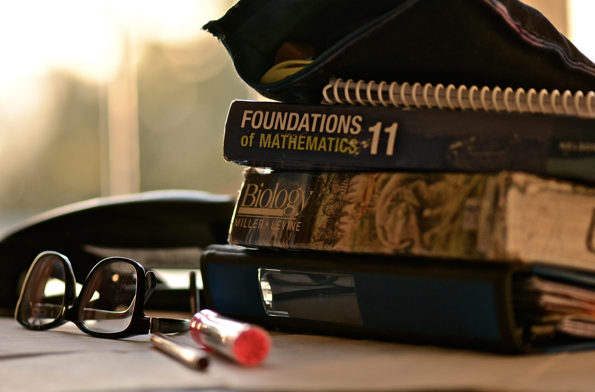

# First Things First!

  

Hello! I am PHD candidate in Applied Math and I'd like to share some of my work. So 
Not everything I've published here is exactly my own work. Many things are progress from other researchers and papers that I am interested in.
English language is not my native language so may I have committed several mistakes while writing here. 
Feel free to send me an email, if you see something strangely written! Please!

Anyway, I hope you like the texts! :blush:

###### Please remember that the only abstract math is the one you didn't understand yet. 

---

## [Imaging methods with Electromagnetic data](https://yuri-albuquerque.github.io/yuri_blog/EW)
## [The Adjoint Method](https://yuri-albuquerque.github.io/yuri_blog/theAdjointMethod)
